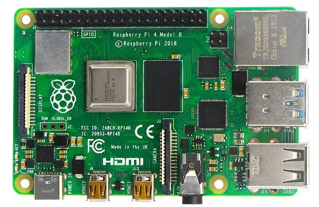
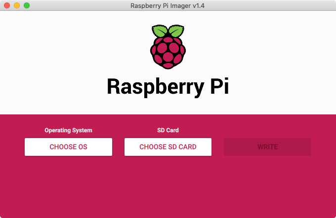

# Azure IoT Central Device Twin Scenario Viewer
The Device Twin Scenario Viewer is a standalone project that is designed assist device developers and testers who are using the forms and update mechanisms in Azure IoT Central. 
## Project Overview and Capabilities...

* <b>Pub/Sub Telemetry Server</b> - Configuration of the components, interfaces and variables for generating telemetry that can be subscribed by your device fleet.
* <b>Device Fleet Provisioning</b> - Configuration of the devices and models supporting provisioning into your Azure IoT Central application.
* <b>Device Fleet Simulation</b> - Configuration of simulation of the devices and subscribing to the Telemetry Server to send Telemetry and firmware simulation for handlign changes to the properties (Twins) and code for handling state changes from property setting, etc.
* <b>Twin History and Diff Viewer</b> - Dashboard viewer that provides a historical view and comparison diff for Twin changes (Desired and Reported)
## Contents
* [Bill of Materials for Cold Hub Monitoring](#bill-of-materials-for-cold-hub-monitoring)
* [Assembling the Raspberry Pi and the Components](#assembling-the-raspberry-pi-and-the-components)
* [Setting up your Development Toolchain](#setting-up-your-development-toolchain)
* [Setting up your Raspberry Pi](#setting-up-your-raspberry-pi)

## Bill of Materials for Cold Hub Monitoring
The following are needed for this project...
#### Components
* Raspberry Pi Board
* AM2315 Temperature and Humidity Sensor
* Ultra Compact RS232 to TTL Converter with Female DB9
* Screw Terminal Block Breakout Module for Raspberry Pi
* SanDisk Ultra microSD Card
* 4 Wires for connecting the RS232 to TTL Converter
#### Tools
* Soldering Iron or Soldering Station
* Solder
* Small Flat Head Screwdriver
* Network Cable
#### Optional
* Monitor or Raspberry Pi Touchscreen
* Keyboard
* Mouse
### Raspberry Pi Model 4 B

The speed and performance of the new Raspberry Pi 4 is a step up from earlier models. For the first time, we've built a complete desktop experience. Whether you're editing documents, browsing the web with a bunch of tabs open, juggling spreadsheets or drafting a presentation, you'll find the experience smooth and very recognisable — but on a smaller, more energy-efficient and much more cost-effective machine.
### AM2315 Temperature and Humidity Sensor


This sensor contains a thermistor temperature sensor and a capacitive humidity sensor. A small microcontroller inside does the readings and provides a simple I2C interface for reading the finished & calibrated output data. Especially nice is that this sensor is in a rugged case with mounting bracket, which makes it way superior to a normal PCB-mounted sensor.

While it is not rated as 'weatherproof', this sensor would do much better for sensing where there might be wind, rain, zombies, etc. than SHT PCB-breakout sensors, and the i2c interface makes it easier to interface with microcomputers that can't do the delicate timing of the DHT sensors.
### Ultra Compact RS232 to TTL Converter with Female DB9


This adapter helps to convert TTL (Transistor-Transistor Logic) level signals to RS-232 interface. This converter has a Female DB9 connector.
### Screw Terminal Block Breakout Module for Raspberry Pi


The Pi Screw Terminal Breakout is the perfect way to connect to the power and signal pins on your Raspberry Pi. It breaks out all 40 pins of the GPIO header to easily accessible and secure screw terminal blocks with labels for each pin function. There’s even a prototyping area for adding circuits or ICs, like level shifters, debounce circuits, or LEDs for example.
### SanDisk Ultra microSD Card


This is the SD card you will load the Raspberry Pi operating system onto and place into the Raspberry Pi board.

## Assembling the Raspberry Pi and the Components
In this section we will walk through the steps to assemble the boards, add the hat and attach all of the sensors so that we have a working IoT device for our coding and testing.

### Solding the Connection "Ultra Compact RS232 to TTL Converter with Female DB9"

The first task is to solder wire connectors for our "RS232 to TTL Converter" that connect the serial output of the Cold Hub and gather telemetry. I am showing using for colored wires to make the differentiation between...

* VCC - DC Power
* TX - Transmit
* RS - Receive
* GND - Ground


## Setting up your Development Toolchain
This section outlines the installation steps and tools needed to develop our ColdHub application on the Raspberry Pi. to Feel free to skip this section if you are already setup for development using Python and Visual Studio Code.
### Install Git
Git is the tool we use for version control and management of software assets.
[LINK: Git Installation Page](https://git-scm.com/book/en/v2/Getting-Started-Installing-Git)
### Install Visual Studio Code
This is the IDE we will use to write code, deploy to the RPi, etc.
[LINK: Visual Studio Code Installation Page](https://code.visualstudio.com/download)
### Install Python
Python is the programming language we will use to build applications for the Raspberry Pi.

From the Python Org:
* Python is powerful... and fast;
* plays well with others;
* runs everywhere;
* is friendly & easy to learn;
* is Open.

[LINK: Python 3 Installation Page](https://www.python.org/downloads/)

### Upgrading Pip
Pip is the package manager we will use to download packages.

On Linux or macOS (Open Terminal):
```
    pip install -U pip
```
On Windows (from a CMD window or Powershell):
```
    python -m pip install -U pip
```
### Install all the Tools for Visual Studio Code
These are a set of extensions inside of the Visual Studio Code editor that we will use to develop our apps on the Raspberry Pi. You can open the extensions sidebar with "Shift+Ctrl+X" or click the Extensions icon in the side navigator bar. Then type in the name of the extension (as indicated in the pics below) and install.


## Setting up your Raspberry Pi
Our first thing to set up is your Raspbian image on the SD card that you load will into the MicroSD cart slot on the Raspberry Pi. Recently the Raspberry Pi Organization published an Operating System imaging tool that is excellent. 

Let's get started by making sure our Raspberry Pi (Operating System) is up to date...
``` bash
sudo apt-get update
sudo apt-get upgrade
sudo pip3 install --upgrade setuptools
```

### Setting up Raspberry Pi Imager


[LINK: Raspberry Pi OS Installation Page](https://www.raspberrypi.org/software/)

I recommend you scroll the section, "Install Raspberry Pi OS using Raspberry Pi Imager" and install the software and watch the short video on that page that explains the imaging process.


#### Here are the tools you need to install...
* The official SD Card Formatter from the SD Association. Install for your OS. [LINK: SD Card Formatter](https://www.sdcard.org/downloads/formatter/)

### Default to Python 3
We want to avoid the use of Python 2 and in our scenarios, it is not used anymore and deprecated. Here is how we tell our system to use Python 3 in all scenarios...
``` bash
sudo apt-get install -y python3 git python3-pip
sudo update-alternatives --install /usr/bin/python python $(which python2) 1
sudo update-alternatives --install /usr/bin/python python $(which python3) 2
sudo update-alternatives --config python
```
Let's check what version of Python and Pip are version defaults...
``` bash
python --version
pip --version
```
### Configuring I2C
I2C is a very commonly used standard designed to allow one chip to talk to another. So, since the Raspberry Pi can talk I2C we can connect it to a variety of I2C capable chips and modules.

The I2C bus allows multiple devices to be connected to your Raspberry Pi, each with a unique address, that can often be set by changing jumper settings on the module. It is very useful to be able to see which devices are connected to your Pi as a way of making sure everything is working.

Install these packages, likely they are already installed and current...
``` bash
sudo apt-get install -y python-smbus
sudo apt-get install -y i2c-tools
```
### Installing Kernel Support (with Raspi-Config)
Run sudo raspi-config and follow the prompts to install i2c support for the ARM core and linux kernel
``` bash
sudo raspi-config
```
Here is the config UX running in the VS Code terminal window...


then I2C...


Enable I2C...


Pick SPI...


Enable SPI...


Pick Serial Port...


Enable Serial Port...


Reboot the Raspberry Pi and then reconnect...
``` bash
sudo reboot
```
### Bring down this Repository to the Raspberry Pi
Next we will create our Project folder and clone this repository. Goto your home directory on the Raspberry Pi...
``` bash
mkdir Projects
cd Projects
git clone https://github.com/Larouex/cold-hub-azure-iot-central.git
```
### Install all the Packages
All of the dependant packages are indicated in the "requirements.txt" file, so we will install them...
``` bash
cd src
pip install -r requirements.txt
```

### Testing and Verifying I2C
Assuming you have the Temperature & Humidiy Sensor connected and all packages installed...
``` bash
python verify.py -d
```
And the output should be (your values may vary)...
``` bash
Sensor: [<adafruit_am2320.AM2320 object at 0xb6575c90>]
Humidity: 33.3%
Temperature: 25.4C
```

Go to Interfacing Options
### Video for Module 01 - Setting up your Raspberry Pi
[](http://www.youtube.com/watch?v=Bb5ookAZsjI "Module 01 - Setting up your Raspberry Pi")
### Configuring the OS for the RPi (Raspbian)
Our first thing to set up is your Raspbian image on the SD card that you load will into the MicroSD cart slot on the Raspberry Pi.

#### Here are the tools you need to install...

* The official SD Card Formatter from the SD Association. Install for your OS. [LINK: SD Card Formatter](https://www.sdcard.org/downloads/formatter/)

* The tool called "balenaEtcher" which is used to copy your Raspbian image onto the formatted SD card. [LINK: balenaEtcher Download Page](https://www.balena.io/etcher/)

* The OS Image for the RPi. We will install the full package named "Raspbian Buster with desktop and recommended software" [LINK: Raspbian Buster Download Page](https://www.raspberrypi.org/downloads/raspbian/)

###### NOTE: balenaEtcher does not require the SD card to be formatted before imaging with Raspbian. I include the process for completeness, but you can skip it if you are so inclined!
#### Now that you have all of that software installed, let's build our SD card for the RPi...

* Place your card into your SD slot on your computer and insure the system can see the card. DO NOT FORMAT IT if you are prompted by your Operating System, just dismiss the dialogs.
* Start the SD Card Formatter software you downloaded.


* The dialog will open, find your SD card (make sure the right drive is selected) and choose the option to "Overwrite format" and give your image a name, anything will do and yes it can be the name of your favorite pet :)


Have a coffee, it will take a bit to do a 16gig card...
#### Next Let's Copy Raspbian to the SD Card...

* Close the SD Formatter Card application
* Open the balenaEtcher application...


* Click the "Select Image" button and select the zip file from the location where you saved it when you downloaded "Buster" from the Raspberry Pi download page
 
 

 * Select the "Flash!" button and sit back let the etcher copy the image and verify it


#### Enable ssh to allow remote login
For security reasons, ssh is no longer enabled by default. To enable it you need to place an empty file named ssh (no extension) in the root of the boot disk.

##### Mac instructions (enable ssh)
    Open up a terminal window and run this command:

    touch /Volumes/boot/ssh


##### Windows instructions (ssh)
    Run Notepad
    * In a new file put in one space and nothing more
    * Click File / Save As …
    * Be sure to set Save as type to All Files (so the file is NOT saved with a .txt extension)
    * Call the file ssh and save it
    * Close the file

    If you are comfortable with the Windows command line you could try this instead (untested!):
        * Open up a command line
        * Switch to the drive and root where boot is located:
        * Type: type NUL >> ssh
        * Verify that file ssh was created

#### Add your WiFi network info
Create a file in the root of boot called: wpa_supplicant.conf (instructions below). Then paste the following into it (adjusting for your ISO 3166 alpha-2 country code, network name and network password):

```
country=US
ctrl_interface=DIR=/var/run/wpa_supplicant GROUP=netdev
update_config=1

network={
    ssid="NETWORK-NAME"
    psk="NETWORK-PASSWORD"
}
```

##### Mac instructions (wifi settings)
Create a new empty file that will hold network info:

     touch /Volumes/boot/wpa_supplicant.conf

Edit the file that you just created and paste the text above into it (adjusting for the name of your country code, network name and network password):

##### Windows instructions (wifi settings)
* Run Notepad
* Paste in the contents above (adjusting for the name of your country code, network name and network password)
* Click File / Save As …
    Be sure to set Save as type to All Files (so the file is NOT saved with a .txt extension)
* Call the file wpa_supplicant.conf and save it
* Close the file

#### Eject the micro SD card
Right-click on boot (on your desktop or File Explorer) and select the Eject option
This is a “logical” eject - meaning it closes files and preps the SD card for removal - you still have to pull the card out yourself
#### Congratulations, you have prepared your OS for the Raspberry Pi

* Make sure your RPi is not plugged in
* Looking from the top of the RPi, install the SD card (the slot is on the bottom of the board) as shown in the picture below...


