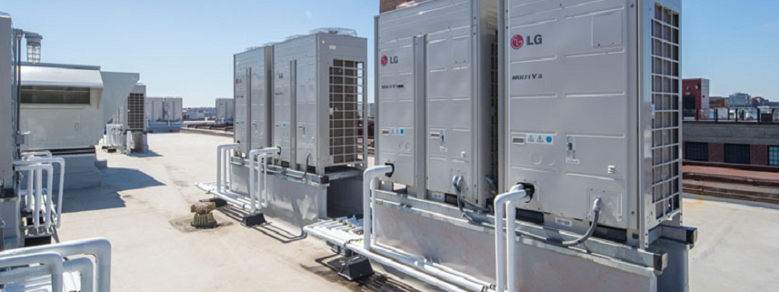

# Azure IoT Central Device Twin Scenario Viewer
The Device Twin Scenario Viewer is a standalone project that is designed assist device developers and testers who are using the forms and update mechanisms in Azure IoT Central. 
## Project Overview

* <b>Powerful Emulation</b> - Dynamic Configuration of OPC-UA Server, Nodes and Variables allow you to emulate topologies. In this project it is an instance of a Smart Commercial Kitchen.
* <b>Azure IoT Central SaaS Integration</b> - Azure IoT Central is our Software as a Service (SaaS) 'Application Platform' that provides telemetry, device management and rich data visualizations. That is just a small part of what it can do. We want to provide you with a way to understand and leverage these features with little coding, some configuration and tons of power!

## Project Capabilities
The capabilities of this project are defined by the various project lifecycle that you configure and prepare your Device and solution on the Azure IoT Central Application platform.

* <b>Pub/Sub Telemetry Server</b> - Configuration of the components, interfaces and variables for generating telemetry that can be subscribed by your device fleet.
* <b>Device Fleet Provisioning</b> - Configuration of the devices and models supporting provisioning into your Azure IoT Central application.
* <b>Device Fleet Simulation</b> - Configuration of simulation of the devices and subscribing to the Telemetry Server to send real-world telemetry values and firmware simulation for handling changes to the properties (Twins) and code for handling state changes from property setting, etc.
* <b>Twin History and Diff Viewer</b> - Dashboard viewer that provides a historical view and comparison diff for Twin changes (Desired and Reported)
## Contents
* [Intended Audience for this Project?](#requirements-for-this-project)
* [Requirements for this Project](#requirements-for-this-project)
* [Intended Audience for this Project?](#)
## Intended Audience for this Project?
* System Integrators
* Developers
* Administrators of an IoT Central Application
## Requirements for this Project
The requirements and preparations are assumed for this project...

* You have an Azure Account

## The Smart Kitchen Overview
The core of this demo application for Azure IoT Central is the emulation of IoT in the context of a commercial kitchen. We have included the following emulated appliance models that you would find in a commercial kitchen...

## HVAC

[LINK: Detailed Overview for the Kitchen HVAC System](./KitchenHVACSystemOverview.md)

    Measurements
    ---------------------------------
    * Airflow Temperature
    * Main Motor RPM
    * CFM

    Baselines and Trends
    ---------------------------------
    * Ideal Temperature = 68 F
    * Main Motor RPM > Trend
    * CFM > Trend

## Walk In Freezer
 

[LINK: Detailed Overview for the Walk In Freezer](./WalkInFreezerOverview.md)

    Measurements
    ---------------------------------
    Temperature
    Humidity
    Door Open Count
    Door Ajar
    Compressor Health

    Baselines and Trends
    ---------------------------------
    Ideal Temperature = 0 F
    Ideal Humidity = 100 RH
    Door Open Count is a Trend
    Door Ajar is a Trend
    Compressor Health > 98

## Walk In Refrigerator
 

[LINK: Detailed Overview for the Walk In Refrigerator](./WalkInRefrigeratorOverview.md)

    Measurements
    ---------------------------------
    Temperature
    Humidity
    Door Open Count
    Door Ajar
    Compressor Health

    Baselines and Trends
    ---------------------------------
    Ideal Temperature = 39 F
    Ideal Humidity = 65 RH
    Door Open Count is a Trend
    Door Ajar is a Trend
    Compressor Health > 98

## Standing Freezer

[LINK: Detailed Overview for the Standing Freezer](./StandingFreezerOverview.md)

    Measurements
    ---------------------------------
    Temperature
    Humidity
    Door Open Count
    Door Ajar
    Compressor Health

    Baselines and Trends
    ---------------------------------
    Ideal Temperature = 0 F
    Ideal Humidity = 100 RH
    Door Open Count is a Trend
    Door Ajar is a Trend
    Compressor Health > 98

## Standing Refrigerator

[LINK: Detailed Overview for the Standing Refrigerator](./StandingRefrigeratorOverview.md)

    Measurements
    ---------------------------------
    Temperature
    Humidity
    Door Open Count
    Door Ajar
    Compressor Health

    Baselines and Trends
    ---------------------------------
    Ideal Temperature = 39 F
    Ideal Humidity = 65 RH
    Door Open Count is a Trend
    Door Ajar is a Trend
    Compressor Health > 98

## Fryer

[LINK: Detailed Overview for the Fryer](./FryerOverview.md)

    Measurements
    ---------------------------------
      Temperature
      Oil Quality
      Fryer Heater Health

    Baselines and Trends
    ---------------------------------
      Ideal Temperature = 350-360 F
      Oil Quality > 75
      Fryer Heater Health > 98

## Cold Table

[LINK: Detailed Overview for the Cold Table](./FryerOverview.md)

    Measurements
    ---------------------------------
      Temperature
      Compressor Health

    Baselines and Trends
    ---------------------------------
      Ideal Temperature = 39 F
      Compressor Health > 98

## Dishwasher

[LINK: Detailed Overview for the Dishwasher](./DishwasherOverview.md)

    Measurements
    ---------------------------------
      Heating Element Health
      Motor Health
      Wash Cycles
      Temperature

    Baselines and Trends
    ---------------------------------
      Ideal Temperature = 180-185 F
      Heating Element Health > 98
      Motor Health > 98
      Wash Cycles - Trend Count
