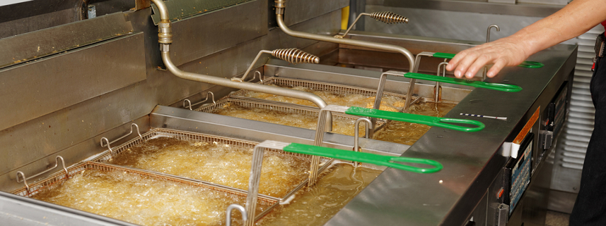

# Fryer - Smart Kitchen OPC-UA Integration with Azure IoT Central

This is a detailed overview of the following...

* <b>The Configuration for the OPC-UA Server</b> We will show the details of the configuration for emulation of the Server, Nodes and Variables for the OPC-UA Server.
* <b>Telemetry</b> The Telemetry that we are emulating.
* <b>Plug and Play Model</b> The Azure Plug and Play Model we are using with IoT Central.

## Fryer

    Measurements
    ---------------------------------
      Temperature
      Oil Quality
      Fryer Heater Health

    Baselines and Trends
    ---------------------------------
      Ideal Temperature = 350-360 F
      Oil Quality > 75
      Fryer Heater Health > 98