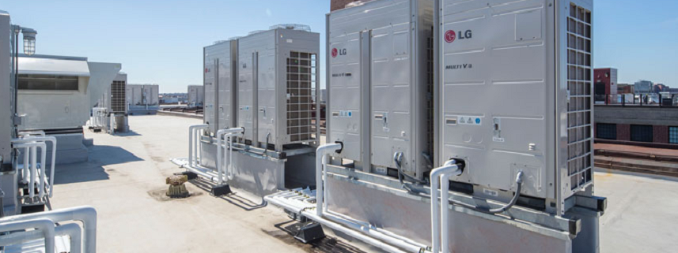

# Kitchen HVAC System - Smart Kitchen OPC-UA Integration with Azure IoT Central


This is a detailed overview of the following...

* <b>The Configuration for the OPC-UA Server</b> We will show the details of the configuration for emulation of the Server, Nodes and Variables for the Telemetry Server.
* <b>Telemetry</b> The Telemetry that we are emulating.
* <b>Plug and Play Model</b> The Azure Plug and Play Model we are using with IoT Central.

## Kitchen HVAC System

    Measurements
    ---------------------------------
    * Airflow Temperature
    * Main Motor RPM
    * CFM

    Baselines and Trends
    ---------------------------------
    * Ideal Temperature = 68 F
    * Main Motor RPM > Trend
    * CFM > Trend

## Configuration for Telemetry Simulation
````json
{
  "Name": "HVAC",
  "InterfacelId": "dtmi:larouexSmartKitchen2049:LarouexSmartKitchen:HVACInterface;1",
  "InterfaceInstanceName": "HVACInterface",
  "Variables": [
    {
      "DisplayName": "HVAC Airflow Temperature",
      "TelemetryName": "hvac_airflow_temperature",
      "IoTCDataType": "float",
      "Frequency": "Ring3",
      "OnlyOnValueChange": false,
      "RangeValues": [
        72.45,
        73.23,
        73.90,
        71.54,
        72.28,
        73.23
      ]
    },
    {
      "DisplayName": "HVAC Airflow CFM",
      "TelemetryName": "hvac_cfm_airflow",
      "IoTCDataType": "integer",
      "Frequency": "Ring3",
      "OnlyOnValueChange": false,
      "RangeValues": [
        127,
        121,
        131,
        130,
        129
      ]
    },
    {
      "DisplayName": "HVAC Main Motor RPM",
      "TelemetryName": "hvac_rpm_mainmotor",
      "IoTCDataType": "integer",
      "Frequency": "Ring2",
      "OnlyOnValueChange": false,
      "RangeValues": [
        18000,
        18500,
        18200,
        19000,
        19200
      ]
    }
  ]
}
````